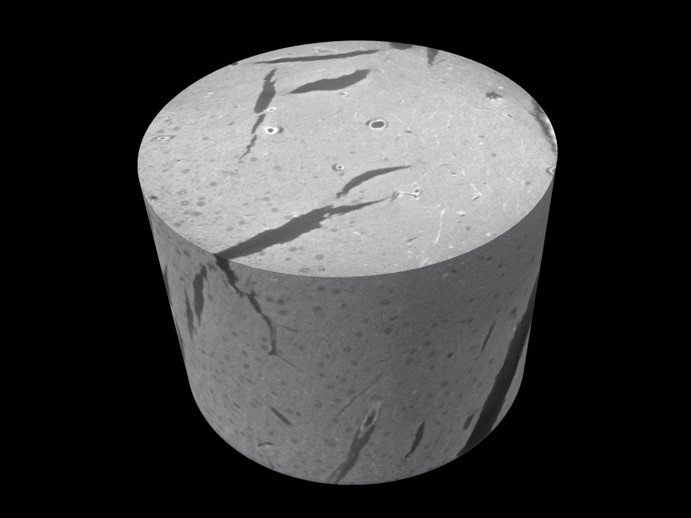
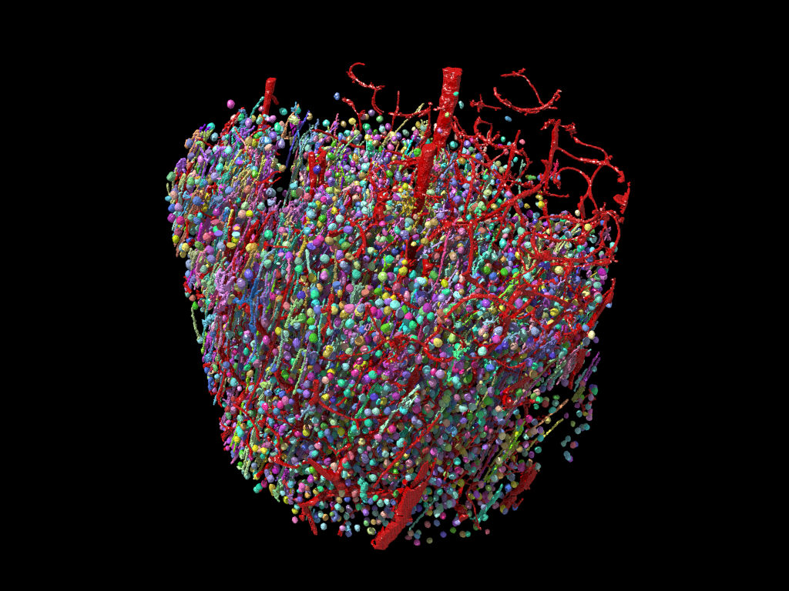
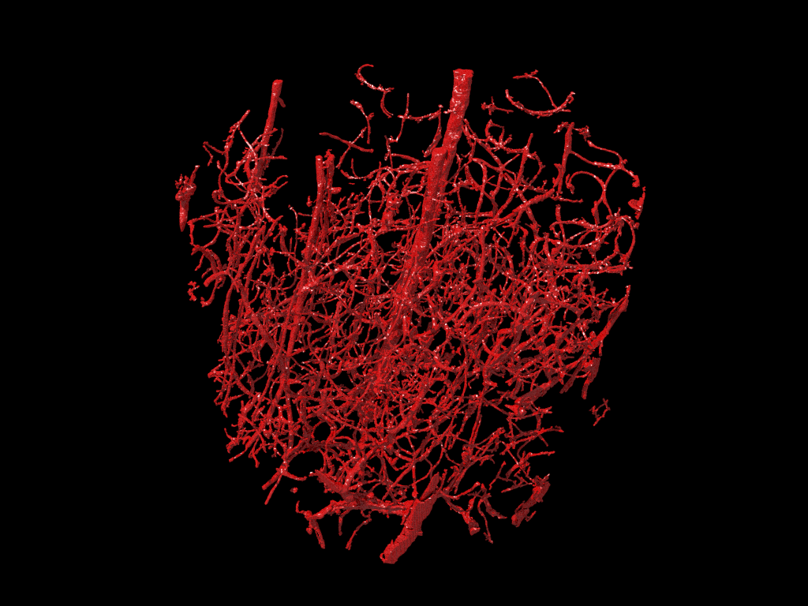
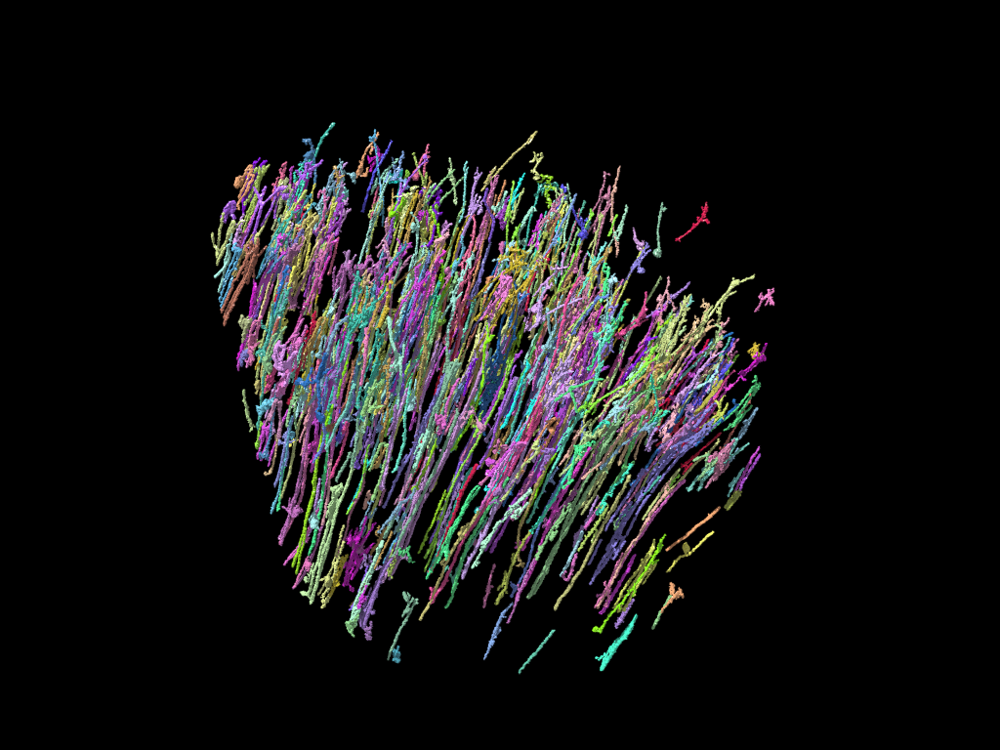
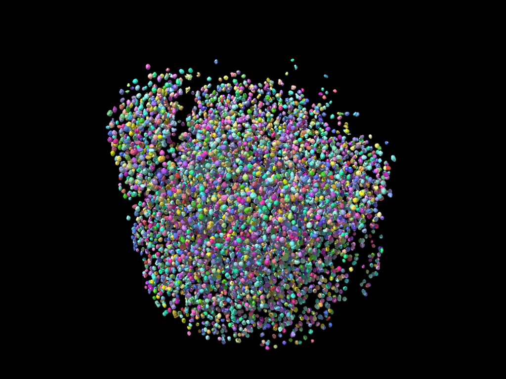

# uct_seg

MicroCT 3D volume segmentation toolset for PyTorchConnectomics workflows.

## Demo

Segmentation outputs on a microCT volume:

| Input | All targets |
|---|---|
|  |  |

| Blood vessel | Dendrite | Soma |
|---|---|---|
|  |  |  |

## Scope

Per-target sub-packages:

| Module | Purpose |
|---|---|
| `uct_seg.bv` | Blood vessel segmentation |
| `uct_seg.artifact` | Crack / bright-aggregate masking |
| `uct_seg.nuclei` | Nuclei (cb) segmentation + curation |
| `uct_seg.dendrite` | Large dendrite segmentation |
| `uct_seg.celltype` | Cell-type classification (planned) |

Shared infrastructure:

| Module | Purpose |
|---|---|
| `uct_seg.util.io` | h5/png/txt I/O, VAST png ↔ uint32 seg, mkdir, dtype packing |
| `uct_seg.util.vast` | VAST meta parsing, anchor-tree writer, good/bad relabel |
| `uct_seg.util.seg_ops` | `removeSeg`, `removeSmall`, `relabel`, `seg_iou3d`, `get_bb_label*` |
| `uct_seg.util.imops` | `imAdjust`, CLAHE |
| `uct_seg.util.viz` | Neuroglancer layer helpers + viewer launcher |
| `uct_seg.util.butterfly` | `write_bfly_v2` JSON spec writer |
| `uct_seg.slurm` | Parameterized SLURM script generator |

`scripts/` holds one-shot dataset prep pipelines ported from the lab's legacy `ct/` codebase (NucMM/Nag, Dyer-17, Xiaotang synchrotron, neuroglancer upload).

`configs/` holds PyTC YAML configs per target (thin wrappers — training runs through `pytc` CLI).

`tests/` holds runnable smoke tests on synthetic data (no cluster paths required).

`demo/` holds visual showcase images of segmentation results — see `demo/README.md`.

`docs/data_paths.md` lists known cluster paths for source datasets.

## Install

```bash
pip install -e .
# extras:
pip install -e ".[viz,cv,cc,pytc]"
```

## Quick start

```python
from uct_seg.util.io import readh5, writeh5, vast2Seg, seg2Vast
from uct_seg.util.vast import vastMetaRelabel, writeVastAnchorTreeById
from uct_seg.util.seg_ops import seg_iou3d, removeSeg
from uct_seg.util.viz import ngLayer3, launch_viewer
```

Run a dataset prep:

```bash
python scripts/prep_nucmm.py 8       # quantize + downsample images
python scripts/prep_nucmm.py 9       # create neuroglancer precomputed
python scripts/prep_xt_ct.py 0.1 0 4 # quantize tiffs, 4-way parallel
```

Generate SLURM jobs:

```bash
uct-slurm-gen nag --num 10 --cmd "python scripts/prep_nucmm.py 0"
```

## Status

| Target | Status |
|---|---|
| io / vast / seg_ops / imops / viz / butterfly / slurm | DONE (ported) |
| nuclei.postproc / nuclei.curate | DONE (ported) |
| artifact.mask | DONE (ported) |
| bv | CURRENT (preproc stub, training via pytc config) |
| dendrite | TODO |
| celltype | TODO |
